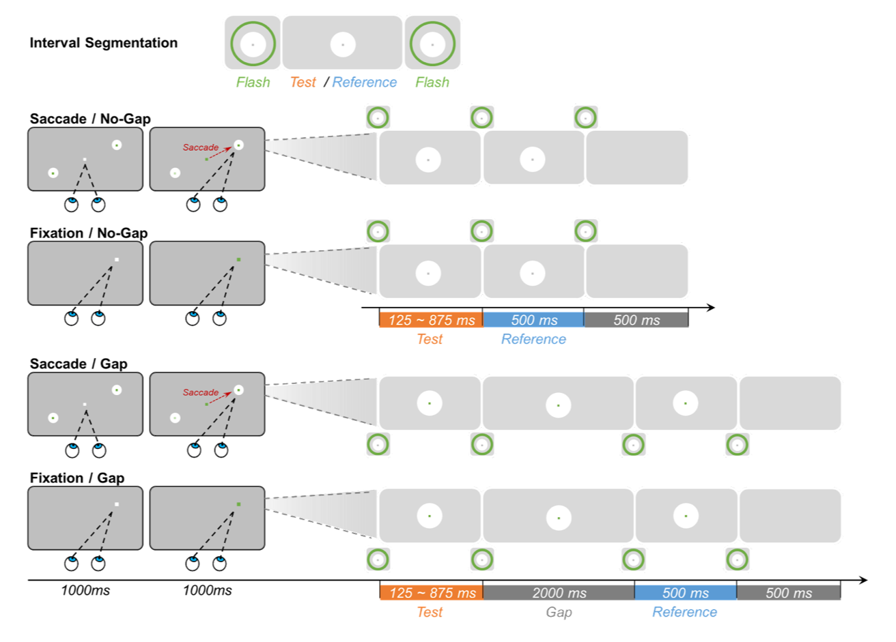
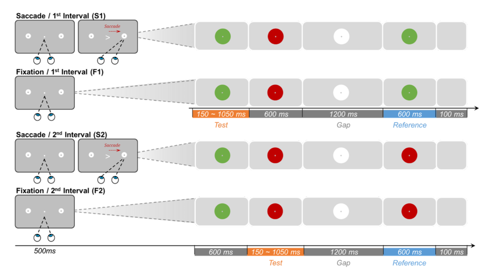

```{r setup, include=FALSE}
knitr::opts_chunk$set(echo = TRUE)
getwd()
```


```{r library, include=FALSE}
library(tidyverse)
library(quickpsy)  # fitting psychometric function
library(png)
library(ez)
library(ggplot2)
library(ggsignif)
```


## Experiment Information

### Study Design
#### Exp 1


#### Exp 2



## Results
### Import Data

```{r, ImportData, include=FALSE, warning=FALSE, error=FALSE}

data <- read.csv('data.csv')
data1 <- data[data$Exp == "Exp1", ]
data2 <- data[data$Exp == "Exp2", ]

```


### Exp 1
#### Psychometric function
##### Individual plots

```{r, echo=FALSE, warning=FALSE, error=FALSE, message=FALSE}

# --- quickpsy ---
# - with lapses and guess rate and bootstrap -
# fits1 <- data1 %>% 
#   quickpsy(., x = TestDuration, k = Long, 
#            grouping = .(Condition, SubID),
#            bootstrap = "parametric", lapses = T, guess = T,
#            parini = list(c(100, 1000),c(100, 1000), c(0, 0.3), c(0, 0.3)))
# saveRDS(fits1, file = 'psyfits_1.rds') 
fits1 <- readRDS('psyfits_1.rds')


fits1 %>%
  plotcurves(color = Condition, ci = FALSE, threshold = FALSE, curves = FALSE) +  
  geom_line(data = fits1$curves, aes(x, y, linetype = Condition, color = Condition)) +
  geom_hline(yintercept = 0.5, linetype="dashed", color = "#636363", size = 0.3) +
  scale_linetype_manual(values = c("solid", "twodash", "solid", "twodash"), name = "Conditions", 
                        labels = c("Fixation / Gap", "Fixatio / No-gap",
                                   "Saccade / Gap", "Saccade / No-gap")) +
  scale_color_manual(values = c("#5ab4ac", "#5ab4ac", "#d8b365", "#d8b365"), name = "Conditions",
                    labels = c("Fixation / Gap", "Fixatio / No-gap", 
                               "Saccade / Gap", "Saccade / No-gap")) +
  xlab("Duration(ms)") +
  ylab("proportion of 'long' responses") +
  theme_classic() -> pmcurve1
pmcurve1

```


##### Example plots (Sub 1)

```{r, echo=FALSE, warning=FALSE, error=FALSE, message=FALSE}

# plot Sub 1 separetely
# with lapses and guess rate and bootstrap
fits1_sub1 <- data1 %>% filter(SubID == 1) %>%
  quickpsy(., x = TestDuration, k = Long, 
           grouping = .(Condition, SubID),
           bootstrap = "parametric",  lapses = T, guess = T,
           parini = list(c(100, 1000),c(100, 1000), c(0, 0.3), c(0, 0.3)))

fits1_sub1 %>% plotcurves(color = Condition, ci = FALSE, threshold = FALSE, curves = FALSE) +  
  geom_line(data = fits1_sub1$curves, aes(x, y, linetype = Condition, color = Condition)) +
  geom_point(data = fits1_sub1$averages, aes(x = TestDuration, y = prob, shape = Condition, color = Condition), size = 2.4) +
  geom_hline(yintercept = 0.5, linetype="dashed", color = "#636363", size = 0.3) +
  scale_linetype_manual(values = c("solid", "twodash", "solid", "twodash"), name = "Conditions", 
                        labels = c("Fixation / Gap", "Fixatio / No-gap",
                                   "Saccade / Gap", "Saccade / No-gap")) +
  scale_color_manual(values = c("#5ab4ac", "#5ab4ac", "#d8b365", "#d8b365"), name = "Conditions",
                    labels = c("Fixation / Gap", "Fixatio / No-gap", 
                               "Saccade / Gap", "Saccade / No-gap")) +
  scale_shape_manual(values = c(17, 16, 17, 16), name = "Conditions", 
                        labels = c("Fixation / Gap", "Fixatio / No-gap",
                                   "Saccade / Gap", "Saccade / No-gap")) +
  xlab("Duration(ms)") +
  ylab("Proportion of 'long' responses") +
  theme_classic() -> pmcurve1_sub1
pmcurve1_sub1
# ggsave(pmcurve1_sub1, file = 'Plots/pmcurve1.png', width = 7, height = 5, units = "in")

```


#### PSE
##### Comparing with standard reference duration (simple t test)

```{r, warning=FALSE, message=FALSE, error=FALSE}

# compare pse with the standard duration (500ms)
# convert to factors
thresholds1 <- fits1$thresholds 
thresholds1$SubID <- as.factor(thresholds1$SubID)
thresholds1$Condition <- as.factor(thresholds1$Condition)

# thresholds for 4 conditions separately
# NonGap-Fix
thre_ngf <- thresholds1 %>% filter(Condition == "Fix-nonGap")
# NonGap-Sac
thre_ngs <- thresholds1 %>% filter(Condition == "Sac-nonGap")
# Gap-Fix
thre_gf <- thresholds1 %>% filter(Condition == "Fix-Gap")
# Gap-Sac
thre_gs <- thresholds1 %>% filter(Condition == "Sac-Gap")

# NonGap-Fix
t_ngf <- t.test(thre_ngf$thre, mu = 500)
t_ngf

# NonGap-Sac
t_ngs <- t.test(thre_ngs$thre, mu = 500)
t_ngs

# Gap-Fix
t_gf <- t.test(thre_gf$thre, mu = 500)
t_gf

# Gap-Sac
t_gs <- t.test(thre_gs$thre, mu = 500)
t_gs

# adjust p-values for multiple comparisons
t_val <- c(t_ngf$p.value, t_ngs$p.value, t_gf$p.value, t_gs$p.value)
t_val

t_adj <- p.adjust(p = t_val, method = "BH", n = length(t_val))
t_adj

```


##### ANOVA

```{r, warning=FALSE, message=FALSE, error=FALSE}

# Separate 4 conditions to 2 * 2
# --- "Sac/Fix" ---
thresholds1$Sac = case_when(thresholds1$Condition == "Fix-Gap" | 
                               thresholds1$Condition == "Fix-nonGap" ~ "Fixation",
                            thresholds1$Condition == "Sac-Gap" | 
                              thresholds1$Condition == "Sac-nonGap" ~ "Saccade")

# --- "Gap/noGap" ---
thresholds1$Gap = case_when(thresholds1$Condition == "Sac-Gap" | 
                              thresholds1$Condition == "Fix-Gap" ~ "Gap",
                            thresholds1$Condition == "Sac-nonGap" | 
                              thresholds1$Condition == "Fix-nonGap" ~ "nonGap")

# convert to factors
thresholds1$Sac <- as.factor(thresholds1$Sac)
thresholds1$Gap <- as.factor(thresholds1$Gap)


# -- ANOVA --
ezExp1_sg <- ezANOVA(data = thresholds1,
                  dv = thre, 
                  within = interaction(Sac, Gap),
                  type = 3,
                  wid = SubID)
ezExp1_sg

```


#### JND

```{r, warning=FALSE, message=FALSE, error=FALSE}

# JND
par1 = fits1$par %>% 
  dplyr::select(-parinf,-parsup) %>% 
  spread(parn, par) %>%
  group_by(Condition) %>% 
  rename(jnd = p2, guessrate = p3, lapserate = p4)

# Separate 4 conditions to 2 * 2
# --- "Sac/Fix" ---
par1$Sac = case_when(par1$Condition == "Fix-Gap" | par1$Condition == "Fix-nonGap" ~ "Fixation",
                     par1$Condition == "Sac-Gap" | par1$Condition == "Sac-nonGap" ~ "Saccade")

# --- "Gap/noGap" ---
par1$Gap = case_when(par1$Condition == "Sac-Gap" | par1$Condition == "Fix-Gap" ~ "Gap",
                     par1$Condition == "Sac-nonGap" | par1$Condition == "Fix-nonGap" ~ "nonGap")

# -- ANOVA --
# - JND -
ezExp1_jnd <- ezANOVA(data = par1,
                  dv = jnd, 
                  within = interaction(Sac, Gap),
                  wid = SubID)
ezExp1_jnd

```


#### Plotting
##### Mean PSE

```{r, echo=FALSE, warning=FALSE, error=FALSE, message=FALSE}

# -- thresholds --
# - bar plot -
mPSE1 <- thresholds1 %>%
  dplyr::select(-threinf,-thresup) %>% 
  group_by(Condition, Sac, Gap) %>%
  summarise(pse = mean(thre), n = n(), pse_se = sd(thre)/sqrt(n))

# plotting mean pse
ggplot(mPSE1, aes(Gap, pse, color = Sac, fill = Sac)) +
  geom_bar(stat = 'identity', color = "white", position = position_dodge(width = 0.7), width = 0.7) + 
  geom_text(aes(label = round(pse, digits = 0)), vjust = 3, color = "white",
            position = position_dodge(0.7), size = 4) +
  geom_errorbar(aes(ymin = pse - pse_se/3, ymax = pse + pse_se), position = position_dodge(width = 0.7), width = 0.4) +
  geom_hline(yintercept = 500, linetype="dashed", color = "#636363", size = 0.3) +
  scale_color_manual(values = c("#5ab4ac", "#d8b365"), name = "Condition", aesthetics = c("colour", "fill")) +
  coord_cartesian(ylim = c(200, 600)) +
  xlab("Condition") +
  ylab("Mean PSE") +
  theme_classic() -> plot1_thre_mpse
plot1_thre_mpse

```


##### Mean JND

```{r, echo=FALSE, warning=FALSE, error=FALSE, message=FALSE}

# - average fitted paramters and plot -
mJND1 <- par1 %>% 
  group_by(Condition, Sac, Gap) %>% 
  summarise(mjnd = mean(jnd), n = n(), jnd_se = sd(jnd)/sqrt(n),
            mguessrate = mean(guessrate), n = n(), guess_se = sd(guessrate)/sqrt(n),
            mlapserate = mean(lapserate), n = n(), lapse_se = sd(lapserate)/sqrt(n)) 

# plotting mean jnd
ggplot(mJND1, aes(Gap, mjnd, color = Sac, fill = Sac))+
  geom_bar(stat = 'identity', color = "white", position = position_dodge(width = 0.7), width = 0.7) + 
  geom_text(aes(label = round(mjnd, digits = 0)), vjust = 3, color = "white",
            position = position_dodge(0.7), size = 4) +
  geom_errorbar(aes(ymin = mjnd - jnd_se/3, ymax = mjnd + jnd_se), 
                position = position_dodge(width = 0.7), width = 0.4) +
  scale_color_manual(values = c("#5ab4ac", "#d8b365"), name = "Condition", aesthetics = c("colour", "fill")) +
  coord_cartesian(ylim = c(10, 250)) +
  xlab("Conditions") +
  ylab("Mean JND") +
  theme_classic() -> plot1_mjnd
plot1_mjnd

```


##### sig plot

```{r, echo=FALSE, warning=FALSE, error=FALSE, message=FALSE}

# PSE
plot1_mpse_sig <- plot1_thre_mpse +
  geom_signif(comparisons = list(c('Gap','nonGap')),
              annotation = '*', color = 'black', y_position = 580, tip_length = 0.03, vjust = 0.2, textsize = 6) +
  geom_signif(y_position = c(540, 500), xmin = c(0.8, 1.8), xmax = c(1.2, 2.2),
              annotation = c("*", "*"), tip_length = 0, vjust = 0.2, textsize = 6, color = "black")
plot1_mpse_sig
# ggsave(plot1_mpse_sig, file = 'Plots/plot1_mpse_sig.png', width = 7, height = 5, units = "in")


# JND
plot1_mjnd_sig <- plot1_mjnd +
  geom_signif(comparisons = list(c('Gap','nonGap')),
              annotation = '*', color = 'black', y_position = 245, tip_length = 0.03, vjust = 0.2, textsize = 6) # +
plot1_mjnd_sig
# ggsave(plot1_mjnd_sig, file = 'Plots/plot1_mjnd_sig.png', width = 7, height = 5, units = "in")

```


### Exp 2
#### Psychometric function
##### Individual plots

```{r, echo=FALSE, warning=FALSE, error=FALSE, message=FALSE}
# --- quickpsy ---
# - with lapses and guess rate and bootstrap -
# the lapses rate range was set based on the mean estimated lapses rate in Exp 1
# fits2 <- data2 %>%
#   quickpsy(., x = TestDuration, k = Long,
#            grouping = .(Condition, SubID),
#            bootstrap = "parametric", lapses = T, guess = T,
#            parini = list(c(100, 1000),c(100, 1000), c(0, 0.1), c(0, 0.1)))
# saveRDS(fits2, file = 'psyfits_2.rds')
fits2 <- readRDS('psyfits_2.rds')

fits2 %>% 
  plotcurves(color = Condition, ci = FALSE, threshold = FALSE, curves = FALSE) +  
  geom_line(data = fits2$curves, aes(x, y, linetype = Condition, color = Condition)) +
  geom_hline(yintercept = 0.5, linetype="dashed", color = "#636363", size = 0.3) +
  # linetypes: solid, longdash, dashed, twodash, dotdash, dotted, blank
  scale_linetype_manual(values = c("solid", "twodash", "solid", "twodash"), name = "Conditions", 
                        labels = c("Fixation / 1st Interval", "Fixation / 2nd Interval",
                                   "Saccade / 1st Interval", "Saccade / 2nd Interval")) +
  scale_color_manual(values = c("#5ab4ac", "#5ab4ac", "#d8b365", "#d8b365"), name = "Conditions",
                     labels = c("Fixation / 1st Interval", "Fixation / 2nd Interval",
                                "Saccade / 1st Interval", "Saccade / 2nd Interval")) +
  xlab("Duration(ms)") +
  ylab("proportion of 'long' responses") +
  theme_classic() -> pmcurve2
pmcurve2

```


##### Example plots (Sub 3)

```{r, echo=FALSE, warning=FALSE, error=FALSE, message=FALSE}
# plot Sub 3 separetely
# with lapses and guess rate and bootstrap
fits2_sub3 <- data2 %>% filter(SubID == 3) %>%
  quickpsy(., x = TestDuration, k = Long,
           grouping = .(Condition, SubID),
           bootstrap = "parametric",  
           lapses = T, guess = T,
           parini = list(c(100, 1000),c(100, 1000), c(0, 0.1), c(0, 0.1)))

fits2_sub3 %>% plotcurves(color = Condition, ci = FALSE, threshold = FALSE, curves = FALSE) +  
  geom_line(data = fits2_sub3$curves, aes(x, y, linetype = Condition, color = Condition)) +
  geom_point(data = fits2_sub3$averages, aes(x = TestDuration, y = prob, shape = Condition, color = Condition), size = 2.4) +
  geom_hline(yintercept = 0.5, linetype="dashed", color = "#636363", size = 0.3) +
  scale_linetype_manual(values = c("solid", "twodash", "solid", "twodash"), name = "Conditions", 
                        labels = c("Fixation / 1st Interval", "Fixation / 2nd Interval",
                                   "Saccade / 1st Interval", "Saccade / 2nd Interval")) +
  scale_color_manual(values = c("#5ab4ac", "#5ab4ac", "#d8b365", "#d8b365"), name = "Conditions", 
                     labels = c("Fixation / 1st Interval", "Fixation / 2nd Interval",
                                "Saccade / 1st Interval", "Saccade / 2nd Interval")) +
  scale_shape_manual(values = c(17, 16, 17, 16), name = "Conditions", 
                     labels = c("Fixation / 1st Interval", "Fixation / 2nd Interval",
                                "Saccade / 1st Interval", "Saccade / 2nd Interval")) +
  xlab("Duration(ms)") +
  ylab("proportion of 'long' responses") +
  theme_classic() -> pmcurve2_sub3
pmcurve2_sub3
# ggsave(pmcurve2_sub3, file = 'Plots/pmcurve2_sub3.png', width = 7, height = 5, units = "in")

```


#### PSE
##### Comparing with standard reference duration (simple t test)

```{r, warning=FALSE, message=FALSE, error=FALSE}
thresholds2 = fits2$thresholds 
thresholds2$SubID <- as.factor(thresholds2$SubID)
thresholds2$Condition <- as.factor(thresholds2$Condition)

# thresholds for 4 conditions separately
# Sac-CH
thre_s1 = thresholds2 %>% filter(Condition == "Sac-1st")
# Sac-Post
thre_s2 = thresholds2 %>% filter(Condition == "Sac-2nd")
# Fix-CH
thre_f1 = thresholds2 %>% filter(Condition == "Fix-1st")
# Fix-Post
thre_f2 = thresholds2 %>% filter(Condition == "Fix-2nd")


# Sac-CH
t_s1 = t.test(thre_s1$thre, mu = 600, alternative = "greater")
t_s1

# Sac-Post
t_s2 = t.test(thre_s2$thre, mu = 600, alternative = "greater")
t_s2

# Fix-CH
t_f1 = t.test(thre_f1$thre, mu = 600, alternative = "greater")
t_f1

# Fix-Post
t_f2 = t.test(thre_f2$thre, mu = 600, alternative = "greater")
t_f2

# adjust p-values for multiple comparisons
t_val2 <- c(t_s1$p.value, t_s2$p.value, t_f1$p.value, t_f2$p.value)
t_val2

t_adj2 <- p.adjust(p = t_val2, method = "BH", n = length(t_val2))
t_adj2

```


#### ANOVA

```{r, warning=FALSE, message=FALSE, error=FALSE}

# Separate 4 conditions to 2 * 2
# --- "Sac/Fix" ---
thresholds2$Sac = case_when(thresholds2$Condition == "Fix-1st" | 
                               thresholds2$Condition == "Fix-2nd" ~ "Fixation",
                            thresholds2$Condition == "Sac-1st" | 
                              thresholds2$Condition == "Sac-2nd" ~ "Saccade")

# --- "CH/postCH" ---
thresholds2$Test = case_when(thresholds2$Condition == "Sac-1st" | thresholds2$Condition == "Fix-1st" ~ "First",
                            thresholds2$Condition == "Sac-2nd" | thresholds2$Condition == "Fix-2nd" ~ "Second")

# convert to factors
thresholds2$Sac <- as.factor(thresholds2$Sac)
thresholds2$Test <- as.factor(thresholds2$Test)

# -- ANOVA --
ezExp2_sg <- ezANOVA(data = thresholds2,
                  dv = thre, 
                  within = .(Sac, Test),
                  wid = SubID,
                  type = 3)
ezExp2_sg

```


###### Post-hoc testing

```{r, warning=FALSE, message=FALSE, error=FALSE}

# run step by step directly for the only comparison we care about
# S2 vs. S1
t_S2S1 <- t.test(thre_s2$thre, thre_s1$thre, paired = TRUE, alternative = "greater")
t_S2S1

## Cohen's d
d_S2S1 <- t_S2S1$statistic / sqrt(length(thre_s2$thre) - 1)
d_S2S1

# S2 vs. F2
t_S2F2 <- t.test(thre_s2$thre, thre_f2$thre, paired = TRUE, alternative = "greater")
t_S2F2

## Cohen's d
d_S2F2 <- t_S2F2$statistic / sqrt(length(thre_s2$thre) - 1)
d_S2F2

# S1 vs. F1
t_S1F1 <- t.test(thre_s1$thre, thre_f1$thre, paired = TRUE)
t_S1F1

## Cohen's d
d_S1F1 <- t_S1F1$statistic / sqrt(length(thre_s1$thre) - 1)
d_S1F1

# adjust p-values for multiple comparisons
t_PH2 <- c(t_S2S1$p.value, t_S2F2$p.value, t_S1F1$p.value)
t_PH2

t_adjPH2 <- p.adjust(p = t_PH2, method = "BH", n = length(t_PH2))
t_adjPH2

```


#### JND

```{r, warning=FALSE, message=FALSE, error=FALSE}

# JND
par2 = fits2$par %>% 
  dplyr::select(-parinf,-parsup) %>% 
  spread(parn, par) %>% 
  group_by(Condition) %>% 
  rename(jnd = p2, guessrate = p3, lapserate = p4)

# Separate 4 conditions to 2 * 2
# --- "Sac/Fix" ---
par2$Sac = case_when(par2$Condition == "Fix-1st" | par2$Condition == "Fix-2nd" ~ "Fixation",
                     par2$Condition == "Sac-1st" | par2$Condition == "Sac-2nd" ~ "Saccade")

# --- "1st/2nd" ---
par2$Test = case_when(par2$Condition == "Sac-1st" | par2$Condition == "Fix-1st" ~ "First",
                     par2$Condition == "Sac-2nd" | par2$Condition == "Fix-2nd" ~ "Second")

# - ANOVA -
ezExp2_jnd_sg <- ezANOVA(data = par2,
                  dv = jnd, 
                  within = interaction(Sac, Test),
                  wid = SubID)
ezExp2_jnd_sg

```


#### Plotting
##### Mean PSE

```{r, echo=FALSE, warning=FALSE, error=FALSE, message=FALSE}

# -- thresholds --
# - bar plot -
mPSE2 <- thresholds2 %>%
  dplyr::select(-threinf, -thresup) %>% 
  group_by(Condition, Sac, Test) %>%
  summarise(pse = mean(thre), n = n(), pse_se = sd(thre)/sqrt(n)) 

# plotting mean pse
ggplot(mPSE2, aes(Test, pse, color = Sac, fill = Sac)) +
  geom_bar(stat = 'identity', color = "white", position = position_dodge(width = 0.7), width = 0.7) + 
  geom_text(aes(label = round(pse, digits = 0)), vjust = 3, color = "white",
            position = position_dodge(0.7), size = 4) +
  geom_errorbar(aes(ymin = pse - pse_se/3, ymax = pse + pse_se), 
                position = position_dodge(width = 0.7), width = 0.4) +
  geom_hline(yintercept = 600, linetype="dashed", color = "#636363", size = 0.3) +
  scale_color_manual(values = c("#5ab4ac", "#d8b365"), name = "Condition", aesthetics = c("colour", "fill")) +
  coord_cartesian(ylim = c(400, 790)) +
  xlab("Condition") +
  ylab("Mean PSE") +
  theme_classic() -> plot2_thre_mpse
plot2_thre_mpse
# ggsave(plot2_thre_mpse, file = 'Plots/plot2_thre_mpse.png', width = 7, height = 5, units = "in")

```


##### Mean JND

```{r, echo=FALSE, warning=FALSE, error=FALSE, message=FALSE}

# - average fitted paramters and plot -
mJND2 <- par2 %>%
  group_by(Condition, Sac, Test) %>%
  summarise(mjnd = mean(jnd), n = n(), jnd_se = sd(jnd)/sqrt(n),
            mguessrate = mean(guessrate), n = n(), guess_se = sd(guessrate)/sqrt(n),
            mlapserate = mean(lapserate), n = n(), lapse_se = sd(lapserate)/sqrt(n)) 

# plotting mean jnd
ggplot(mJND2, aes(Test, mjnd, color = Sac, fill = Sac))+
  geom_bar(stat = 'identity', color = "white", position = position_dodge(width = 0.7), width = 0.7) + 
  geom_text(aes(label = round(mjnd, digits = 0)), vjust = 3, color = "white",
            position = position_dodge(0.7), size = 4) +
  geom_errorbar(aes(ymin = mjnd - jnd_se/3, ymax = mjnd + jnd_se), 
                position = position_dodge(width = 0.7), width = 0.4) +
  scale_color_manual(values = c("#5ab4ac", "#d8b365"), name = "Condition", aesthetics = c("colour", "fill")) +
  coord_cartesian(ylim = c(14, 340)) +
  xlab("Condition") +
  ylab("Mean JND") +
  theme_classic() -> plot2_mjnd
plot2_mjnd
# ggsave(plot2_mjnd, file = 'Plots/plot2_mjnd.png', width = 7, height = 5, units = "in")

```


##### sig plot

```{r, echo=FALSE, warning=FALSE, error=FALSE, message=FALSE}
# PSE
# Interaction effect
plot2_mpse_sig <- plot2_thre_mpse +
  # Sac: 1st vs. 2nd
  geom_signif(y_position = 773, xmin = 1, xmax = 2,
              annotation = "*", tip_length = 0.1, vjust = 0.4, textsize = 6, color = "black") +
  # 2nd: Sac vs. Fix
  geom_signif(y_position = c(760, 760), xmin = c(0.8, 1.8), xmax = c(1.2, 2.2),
              annotation = c(" ", " "), tip_length = 0.05, vjust = 1.8, textsize = 6, color = "black")
plot2_mpse_sig
# ggsave(plot2_mpse_sig, file = 'Plots/plot2_mpse_sig.png', width = 7, height = 5, units = "in")

```
